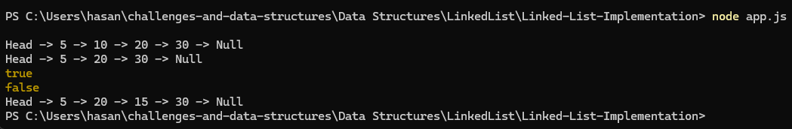

# Linked List — JavaScript (Jest)

Singly linked list implementation with Jest tests.

## How to run

npm install
npm test
npm start

## Expected output (npm start)

Head -> 5 -> 10 -> 20 -> 30 -> Null
Head -> 5 -> 20 -> 30 -> Null
true
false
Head -> 5 -> 20 -> 15 -> 30 -> Null

## Output

