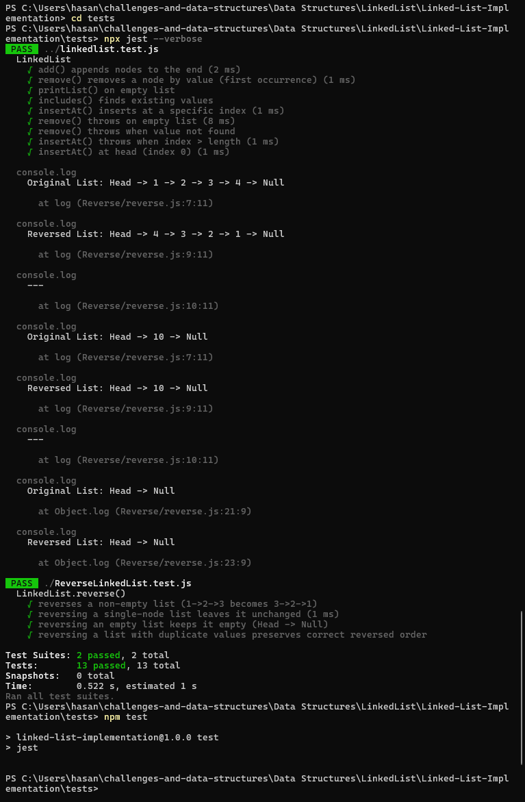

# Linked List — Reverse

## Problem Domain

Reverse a singly linked list **in-place** using the existing `LinkedList` implementation. Do not allocate a new list — flip the `next` pointers and update `head`.

## Inputs and Expected Outputs

- Example: `Head -> 1 -> 2 -> 3 -> 4 -> Null` -> after `reverse()` -> `Head -> 4 -> 3 -> 2 -> 1 -> Null`

## Edge Cases

- Empty list (`Head -> Null`) remains empty.
- Single node list remains the same.
- Lists with duplicate values should reverse the element order (duplicates preserved).

## Algorithm (iterative, in-place)

