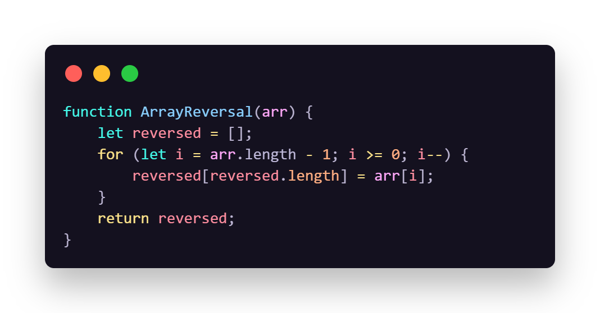

# Coding Challenges

## Challenge A: Array Reversal

A function that takes an array and returns a new array in reverse order without using any built-in methods.

---

## Challenge B: Most Frequent Number

A function that returns the number that appears the most in a given array. If no duplicates, returns the first number.

### Whiteboard Images  

- Challenge 02: Minimum Value  
  [Minimum-Value](./challenges/README.md)

### Table of Contents

## Whiteboard Imagess

### Challenge 03: Reverse Characters

